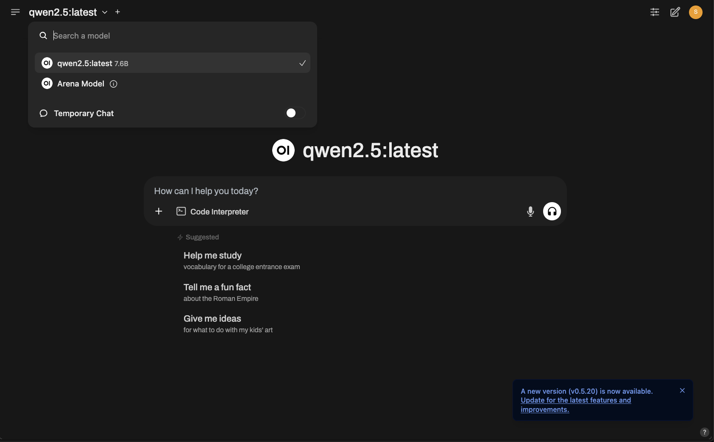
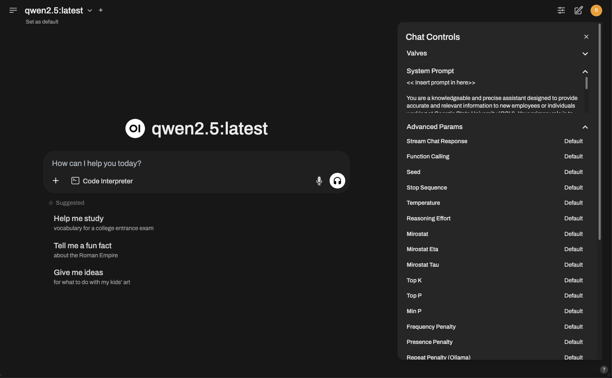
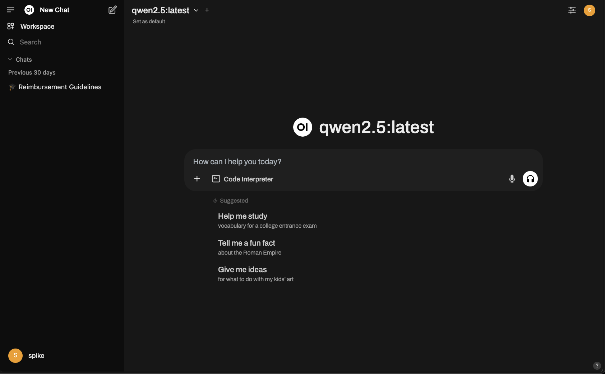

## Obtain a locally hosted LLM

[Download Ollama](https://ollama.com/download)

---

## Install and host the web interface


In another terminal:
```
python3.12 -m venv .venv
source .venv/bin/activate
pip install open-webui
```

Then to host it, just run
```
open-webui-serve
```

## Add your documents


First, choose your model, in this case, I've chosen qwen2.5 (great at document retrieval)



Then, select the settings menu, which will let you paste in your context. All of the documents you'd like the model to reference will go in here.



And you're good! Feel free to try out the model for document retrieval from here.

Finally, to revist old conversations, simply click the menu on the right.


